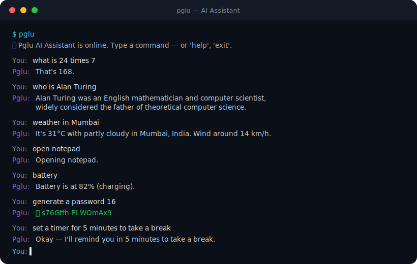
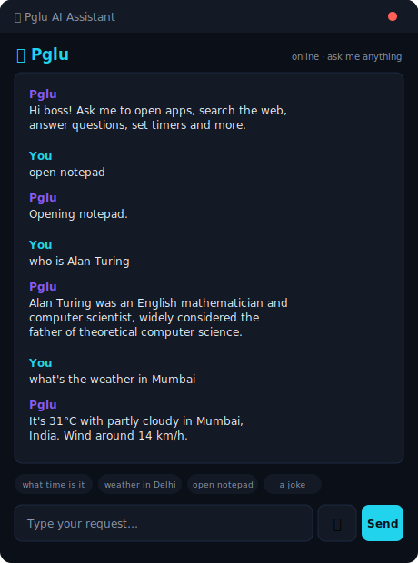

<div align="center">

# 🤖 Pglu AI Assistant

### A privacy-first, plugin-based desktop assistant — your own Jarvis, in Python

Talk or type to **open apps, search the web, answer questions, check your system, set timers,
take notes, and more.** Core features run on the **Python standard library alone** — voice and
system-info are optional extras. Local-first: no cloud brain, no API keys.

<p>
  
  
  
  
</p>

</div>

> **Inspired by** [sukeesh/Jarvis](https://github.com/sukeesh/Jarvis) (plugin CLI assistant),
> [open-jarvis/OpenJarvis](https://github.com/open-jarvis/OpenJarvis) (local-first ethos + a
> `doctor` health check), and [Priler/jarvis](https://github.com/Priler/jarvis) (offline,
> privacy-first voice) — re-imagined as a clean, dependency-light Python package.

---

## 📖 Overview

Pglu AI Assistant is a real desktop assistant that controls your PC and answers your questions —
from a terminal, by **typing or speaking**. It uses a small **plugin "skill" architecture**: each
skill registers regex intents and a handler, so adding new abilities is a few lines. There's no
cloud LLM and no keys: knowledge comes from key-less public APIs (Wikipedia, Open-Meteo) and
everything else runs locally.

## 📸 Preview

<div align="center">
  
</div>

## ✨ Features

- 🧠 **Real conversational AI** — talk naturally (not canned replies), powered by a **local LLM (Ollama, free, private)** or **your own API key** (Claude / GPT / Gemini / Groq). Choose a **personality** and set the AI's name + who you are
- 🎭 **Personalities** — Jarvis, Friendly, Professional, Funny, Savage, Loving, Motivational, Zen — or write your own custom style
- 🧩 **Plugin skill architecture** — 6 skills, ~28 intents; add your own in a few lines
- 🗣️ **Voice *and* text** — speak (SpeechRecognition) and hear replies (pyttsx3), or just type
- 🖥️ **Real PC control** — launch apps (Notepad, Calculator, Settings, Task Manager, VS Code…), open sites
- 🔎 **Web** — Google / YouTube search, open any website
- 🧠 **Answers** — Wikipedia summaries (“who is…”, “what is…”), live **weather** for any city
- 🧮 **Math** — natural language (“what is 24 times 7”) via a safe AST evaluator (no `eval`)
- ⚙️ **System** — battery, CPU, RAM, disk, IP, system info (via `psutil` / stdlib)
- 📝 **Productivity** — notes and timers/reminders
- 🎲 **Fun** — jokes, coin flip, dice, random numbers, secure password generator
- 🩺 **`pglu doctor`** — environment & dependency health check
- 🔒 **Privacy-first & local** — no cloud brain, no API keys; key-less public APIs only
- 🪶 **Zero core dependencies** — extras (`voice`, `system`) are opt-in

## 🧠 Talk to it like Jarvis — AI brain & personality

Out of the box Pglu uses fast rule-based skills. Give it an **AI brain** and it *converses* — in
the **personality and identity you choose**.

**Set it up** (CLI wizard or the GUI ⚙ Settings):

```bash
pglu setup     # asks: AI's name, your name, who you are, personality, AI provider
```

**Two ways to power the brain:**

| Option | How | Cost / privacy |
|--------|-----|----------------|
| 🖥️ **Local (recommended)** | install **[Ollama](https://ollama.com)** → `ollama pull llama3.2` | **free, 100% private, offline** — nothing leaves your PC |
| ☁️ **Your API key** | choose `openai` / `anthropic` / `gemini` / `groq` and paste a key | uses that provider; key stored locally in `~/.pglu/config.json` |

**Personalities:** `jarvis` (default), `friendly`, `professional`, `funny`, `savage`, `loving`,
`motivational`, `zen` — **or type your own** custom style (e.g. *"a chill gen-Z bestie who roasts
me lovingly"*). You also set the **AI's name** and **who you are**, so it addresses you personally.

```text
You: hey, how are you?
Pglu: All systems nominal and delighted to see you, sir. How may I be of service today?
```

> 💡 Real **actions stay reliable** — “open notepad”, “battery”, “set a timer” are executed by the
> app (the AI can't fake those). The AI handles conversation, advice, opinions, and questions.

## 🚀 Installation

Requires **Python 3.9+**. Pick whichever suits you:

**① Easiest — install the `pglu` command directly (no clone needed):**

```bash
pipx install "git+https://github.com/aashishbharti04/pglu-ai-assistant"   # isolated (recommended)
# or:
pip install "git+https://github.com/aashishbharti04/pglu-ai-assistant"
pglu "what is 25 times 4"      # now usable from anywhere
```

**② From PyPI** *(once published):*

```bash
pip install pglu-ai-assistant            # core
pip install "pglu-ai-assistant[full]"    # + voice + system info
pglu
```

**③ From source — for clone / fork / contributing:**

```bash
git clone https://github.com/aashishbharti04/pglu-ai-assistant
cd pglu-ai-assistant
python main.py "what is 25 times 4"      # run without installing
pip install -e ".[full]"                 # editable install + all extras
```

**Optional extras** (mix and match):

| Extra | Adds | Notes |
|-------|------|-------|
| `voice` | speak replies (pyttsx3) + recognition lib | installs cleanly anywhere |
| `system` | battery / CPU / RAM info (psutil) | installs cleanly |
| `wake` | global-hotkey wake (pynput) | installs cleanly |
| `clap` | double-clap wake (sounddevice+numpy) | wheels; needs a mic |
| `mic` | microphone input (PyAudio) | **may need a C++ compiler** — see below |
| `full` | voice + system + wake | **clean on every OS, no compiler** ✅ |
| `everything` | all of the above | only if you can build PyAudio |

```bash
pip install "pglu-ai-assistant[full]"        # recommended — installs everywhere
pip install "pglu-ai-assistant[mic]"         # add microphone input (see troubleshooting)
```

> **PyAudio on Windows / Python 3.14:** if `[mic]`/`[everything]` fails with *"Microsoft Visual
> C++ 14.0 is required"*, it's because PyAudio has no prebuilt wheel for that Python yet. Fixes:
> use **Python 3.12** (`pip install pyaudio` then has a wheel), or `pip install pipwin && pipwin
> install pyaudio`, or install the **C++ Build Tools**. The mic is **optional** — everything else
> (incl. hotkey & clap wake, and Pglu *speaking*) works without it.

## 🖥️ Desktop app — clone & click an icon

Want a real desktop assistant with an icon you click whenever you need it? (Windows / macOS / Linux)

```bash
git clone https://github.com/aashishbharti04/pglu-ai-assistant
cd pglu-ai-assistant
pip install -e .                  # optional but recommended

python -m pglu install-shortcut   # ➜ adds "Pglu AI Assistant" (with app icon) to your Desktop
```

Now **double-click “Pglu AI Assistant” on your Desktop** — a window opens where you **type (or 🎙️
speak)** your request and Pglu answers (and talks back, if you enabled voice). On Windows it launches
with `pythonw`, so there's **no black console window**.

Prefer to open the window directly? `python -m pglu gui` (or `pglu gui`, or the `pglu-gui` command).

<div align="center"></div>

## ⚡ Jarvis mode — hands-free wake (while minimized)

Open the GUI, click **⚙ Settings**, and turn on any of these triggers so Pglu wakes even when the
window is minimized (PC awake — not asleep/locked). When triggered, the window pops to the front
and starts listening (or focuses the box to type):

| Trigger | How to fire it | Needs |
|--------|----------------|-------|
| ⌨ **Global hotkey** | press your combo (default `Ctrl+Alt+P`) anywhere | `pip install "pglu-ai-assistant[wake]"` |
| 👏 **Double-clap** | clap twice | `pip install "pglu-ai-assistant[clap]"` + a mic |
| 🗣 **Wake word** | say your word (default “pglu”) | `[voice]` + `[mic]` |

Each option is greyed out in Settings until its package is installed, with the exact command shown.
Pick the hotkey for the most reliable, lowest-overhead "Iron-Man" wake; add clap/wake-word for
fully hands-free. (True wake-from-sleep/locked-screen needs OS-level scheduling and is out of scope
for a user app.)

## 🕹️ Usage (command line)

```bash
pglu                       # interactive text mode
pglu setup                 # set AI name, persona & brain provider
pglu gui                   # open the desktop window
pglu install-shortcut      # add a clickable Desktop icon
pglu --voice               # interactive voice mode (needs [voice] extra)
pglu doctor                # environment & dependency check
pglu skills                # list everything Pglu can do
pglu "open notepad"        # one-shot command
python main.py "weather in Mumbai"   # without installing
```

### Things to say or type

| Category | Examples |
|----------|----------|
| Apps | `open notepad` · `open calculator` · `launch task manager` · `open settings` |
| Web | `open youtube` · `open github.com` · `search for best laptops` · `youtube lofi beats` |
| Knowledge | `what time is it` · `what's the date` · `who is Ada Lovelace` · `what is gravity` |
| Weather | `weather in Delhi` |
| Math | `what is 24 times 7` · `calculate 100 divided by 4` |
| System | `battery` · `cpu usage` · `how much ram` · `disk space` · `my ip` · `system info` |
| Productivity | `take a note: buy milk` · `read my notes` · `set a timer for 5 minutes` |
| Fun | `tell me a joke` · `flip a coin` · `roll a dice` · `random number 1 to 100` · `generate a password 16` |

## ⚙️ Configuration

Settings live in `~/.pglu/config.json` (assistant name, user name, wake word, TTS rate, default
city). Notes are saved alongside it. Nothing is sent anywhere.

## 🧩 Adding a skill

Create a `Skill` subclass in `pglu/skills/`, register intents, and add it to `SKILL_CLASSES`:

```python
from .base import Skill

class Hello(Skill):
    name = "hello"
    def intents(self):
        return [(r"\bgreet me\b", self.greet)]
    def greet(self, text, m):
        return f"Hello, {self.ctx.config.user_name}!"
```

A handler returns a string (the reply) or `None` to let other intents try. See
[docs/ARCHITECTURE.md](docs/ARCHITECTURE.md).

## ❓ FAQ

**Does it need an API key or the internet?** No keys ever. Most features are offline; only
Wikipedia and weather make (key-less) web calls.

**Voice not working?** Install the `voice` extra and ensure a mic + PyAudio. Voice is optional —
typing always works.

**Is it safe?** Math uses a sandboxed AST evaluator (never `eval`); there are no secrets; system
control is limited to launching apps and reading stats.

## 🤝 Contributing

PRs welcome — new skills especially! See [CONTRIBUTING.md](CONTRIBUTING.md) and the
[Code of Conduct](CODE_OF_CONDUCT.md). Security: [SECURITY.md](SECURITY.md).

## 📄 License

[MIT](LICENSE) © Aashish Bharti — free for educational, learning, and community use.

---

<div align="center">

### 📬 Contact & Connect

**Email:** [aashish@marketdoctorsonline.com](mailto:aashish@marketdoctorsonline.com)

[LinkedIn](https://in.linkedin.com/in/aashana1012) ·
[GitHub](https://github.com/aashishbharti04) ·
[YouTube](https://www.youtube.com/@CodeWithAsur) ·
[Instagram](https://www.instagram.com/asurwave1012)

<sub>© Pglu AI Assistant. All rights reserved. · This project is open source and available for
educational, learning, and community contributions.</sub>

</div>
